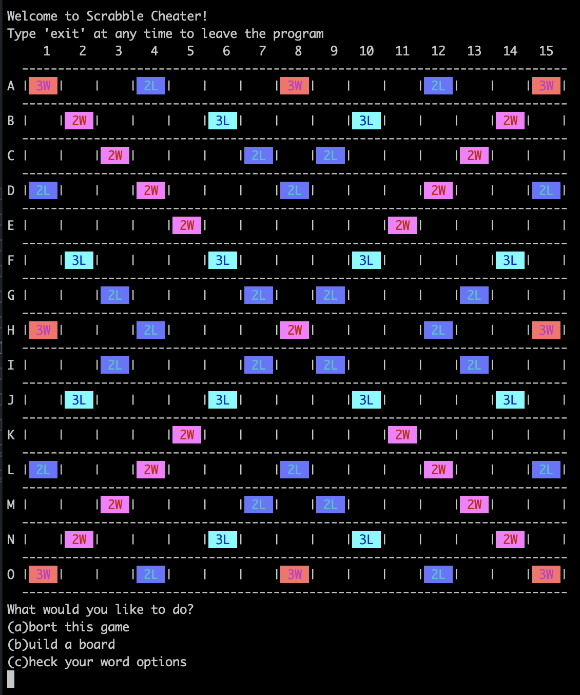

# Scrabble Cheater

A REPL interface for figuring out the best move in your scrabble game.

## Installing on Your Machine

1. Clone the repo.
1. `cd` into the folder that was created by cloning.
1. Run `bundle`.

~FIN~

## Running it on Your Machine

Run `ruby scrabble_cheater.rb` and follow instructions.

## Current Features

* Build out a board by adding tiles.
* Check a word list out of tiles you enter.
* Force a certain letter to be included in your word list.
* Force the inclusion to be within a certain portion of the word.

## Future Plans

* Word list will make suggestions based on tiles on the board.
* Word list will order suggestions based on the score you would receive.
* Board will report your score for each word you add.
